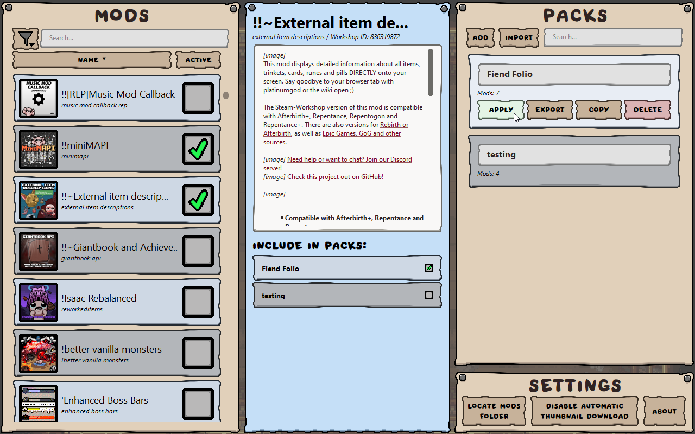
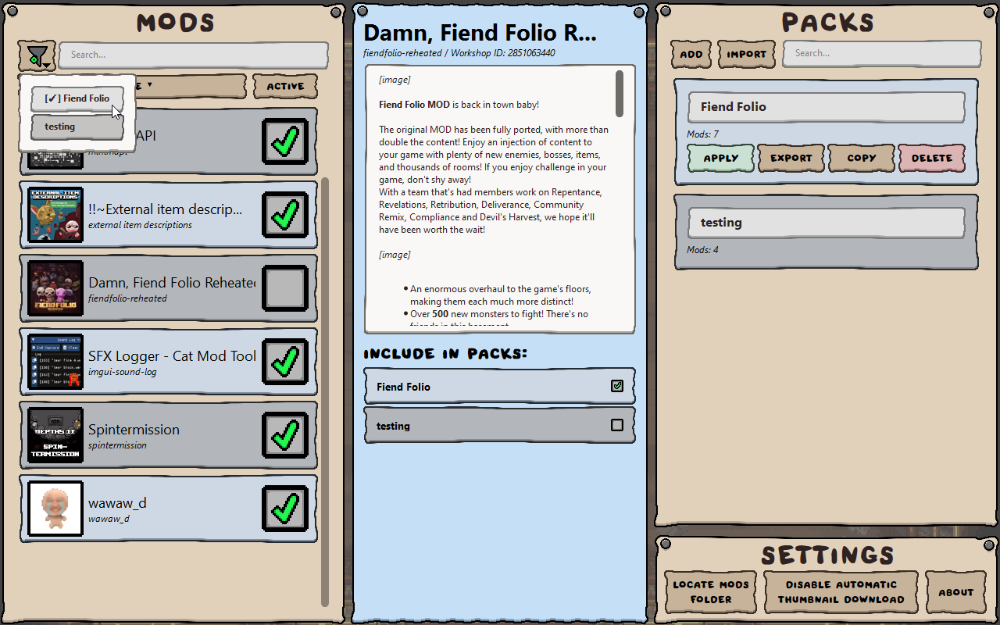

# Bookworm - A Repentance(+) mod and modpack manager!
Bookworm is a mod manager for Repentance and Repentance+ (untested on Afterbirth+). It allows creating and sharing modpacks, as well as managing if your mods are enabled or disabled.




## Build Instructions

I use [`pyinstaller`](https://www.geeksforgeeks.org/convert-python-script-to-exe-file/) to package the python script into an EXE. I do so in a virtual environment with only the necessary packages installed.

First, use pip to install the necessary packages:
```
py pip install -r "requirements.txt"
```

Then just use pyinstaller:
```
pyinstaller --onefile --windowed "main.py"
```

## Consider supporting me on Ko-Fi
[If you think this project is valued higher than $0, please consider supporting me on Ko-Fi!](https://ko-fi.com/catinsurance)